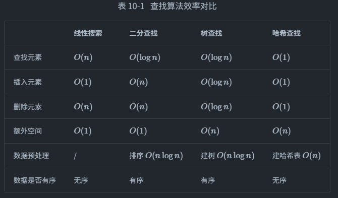

# 搜索算法
「搜索算法 searching algorithm」用于在数据结构（例如数组、链表、树或图）中搜索一个
或一组满足特定条件的元素。

搜索算法可根据实现思路分为以下两类：
- 暴力搜索：通过遍历数据结构来定位目标元素，例如：数组、链表、图的遍历查询
- 自适应搜索：利用数据组织结构或数据包含的先验信息，实现高效元素查找，例如：二分查找、哈希查找和二叉树查找

> 搜索算法的选择还取决于数据体量、搜索性能要求、数据查询与更新频率等。

## 搜索方法选取
线性搜索
- 通用性较好，无须任何数据预处理操作。假如我们仅需查询一次数据，那么其他三种方法的数据预处理的时间比线性搜索的时间还要更长。
- 适用于体量较小的数据，此情况下时间复杂度对效率影响较小。
- 适用于数据更新频率较高的场景，因为该方法不需要对数据进行任何额外维护。

二分查找
-适用于大数据量的情况，效率表现稳定，最差时间复杂度为O(logn)。
- 数据量不能过大，因为存储数组需要连续的内存空间。
- 不适用于高频增删数据的场景，因为维护有序数组的开销较大。

哈希查找
- 适合对查询性能要求很高的场景，平均时间复杂度为O(1)。
- 不适合需要有序数据或范围查找的场景，因为哈希表无法维护数据的有序性。
- 对哈希函数和哈希冲突处理策略的依赖性较高，具有较大的性能劣化风险。
- 不适合数据量过大的情况，因为哈希表需要额外空间来最大程度地减少冲突，从而提供良好的查询性能。

树查找
- 适用于海量数据，因为树节点在内存中是分散存储的。
- 适合需要维护有序数据或范围查找的场景。
- 在持续增删节点的过程中，二叉搜索树可能产生倾斜，时间复杂度劣化至O(n)。
- 若使用 AVL 树或红黑树，则各项操作可在O(logn)效率下稳定运行，但维护树平衡的操作会增加额外的开销。